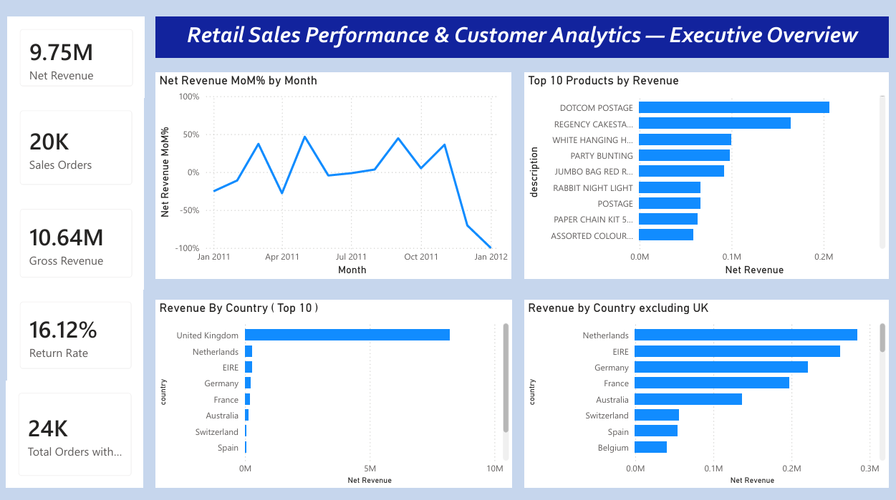
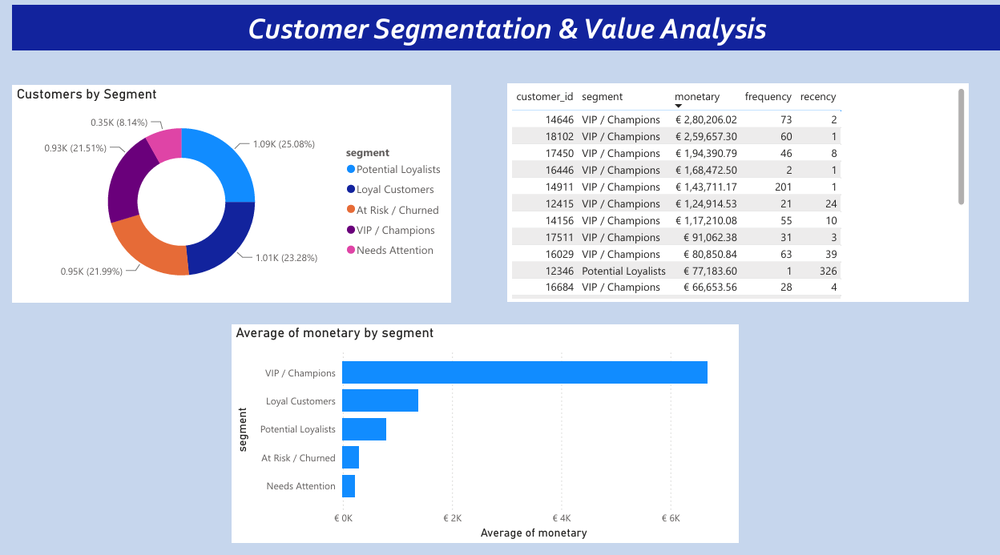
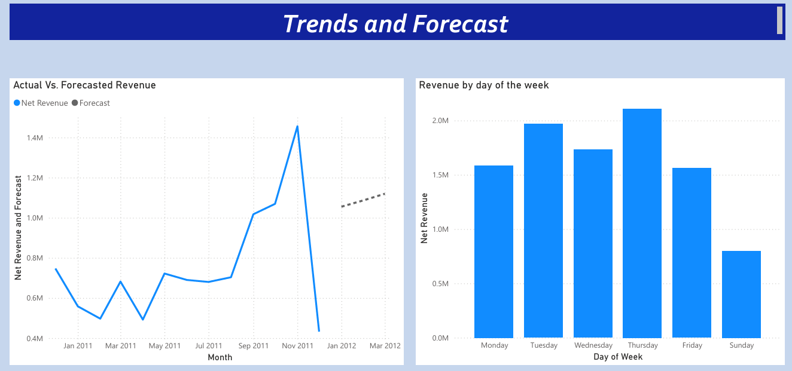

# 🛍️ Retail Sales Performance & Customer Analytics Dashboard


 

## 📌 Project Overview

An end-to-end Retail Analytics project that processes **534,130 retail
transactions** covering **4,372 customers** to generate actionable
business insights.

The project combines **Python, SQL, Forecasting, and Power BI** to clean
data, analyze sales performance, segment customers using **RFM
Analysis**, forecast future sales, and build an interactive dashboard.

## 🛠️ Tech Stack

  Category        Technologies
  --------------- ----------------------------------------
  Programming     Python
  Libraries       Pandas, NumPy, Matplotlib, Statsmodels
  Database        SQL
  Visualization   Power BI
  Data Modeling   DAX
  Analytics       EDA, RFM Segmentation, Forecasting
  Dataset         Online Retail II (UCI/Kaggle)

## 🔄 Project Workflow

``` text
Raw Dataset
   ↓
Data Cleaning
   ↓
EDA
   ↓
SQL Analysis
   ↓
RFM Segmentation
   ↓
Forecasting
   ↓
Power BI Dashboard
```

## 📊 Dashboard Preview

### Executive Overview



### Customer Analytics



### Trends & Forecast


## 📈 Key Results

  Metric                                     Value
  --------------------- --------------------------
  Transactions                             534,130
  Customers                                  4,372
  Net Revenue                               £9.75M
  Gross Revenue                            £10.64M
  Return Rate                               16.12%
  Average Order Value                         £533
  Forecast                £1.06M → £1.09M → £1.12M

## 🎯 Skills Demonstrated

-   Data Cleaning
-   Exploratory Data Analysis
-   SQL
-   RFM Customer Segmentation
-   Forecasting
-   Power BI Dashboard
-   DAX
-   Business KPI Development

## 📁 Project Structure

``` text
Retail-Sales-Customer-Analytics/
├── README.md
├── python/
├── sql/
├── dashboard/
├── screenshots/
└── data/
```

## ⚙️ Setup

1.  Download the Online Retail II dataset.
2.  Install:

``` bash
pip install pandas numpy matplotlib statsmodels
```

3.  Run Python scripts in order.
4.  Execute SQL scripts.
5.  Open the PBIX file in Power BI Desktop.

## 🔧 Technical Challenges

-   Fixed DAX table naming issues.
-   Resolved datetime vs date relationship mismatches.
-   Reconciled KPI differences between Python and Power BI.
-   Corrected ambiguous date parsing.
-   Extended calendar table for forecast periods.

## 🚀 Future Improvements

-   Customer Lifetime Value
-   Churn Prediction
-   Recommendation Engine
-   Automated Refresh

## 📄 License

Educational and portfolio purposes.
